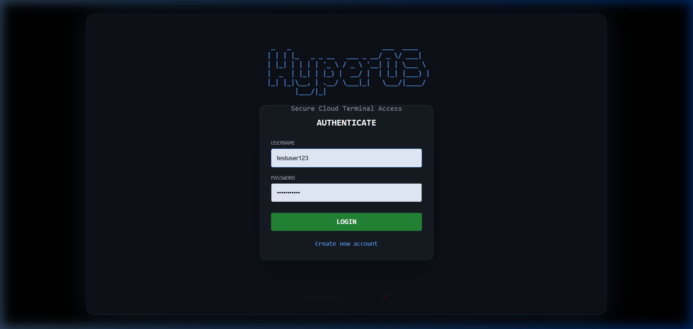
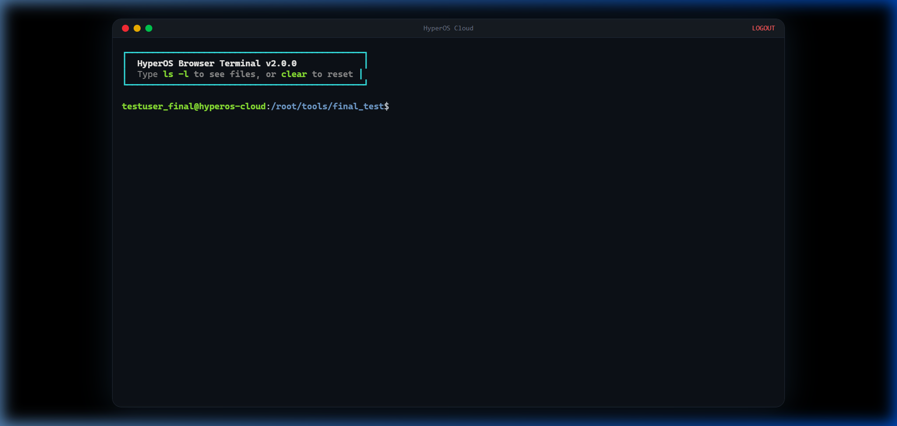
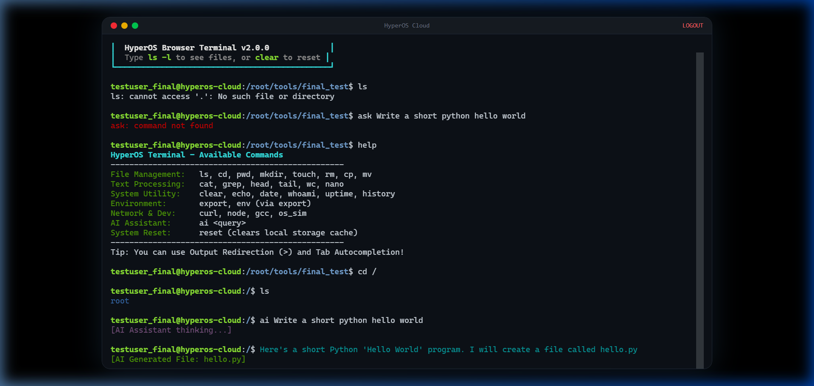
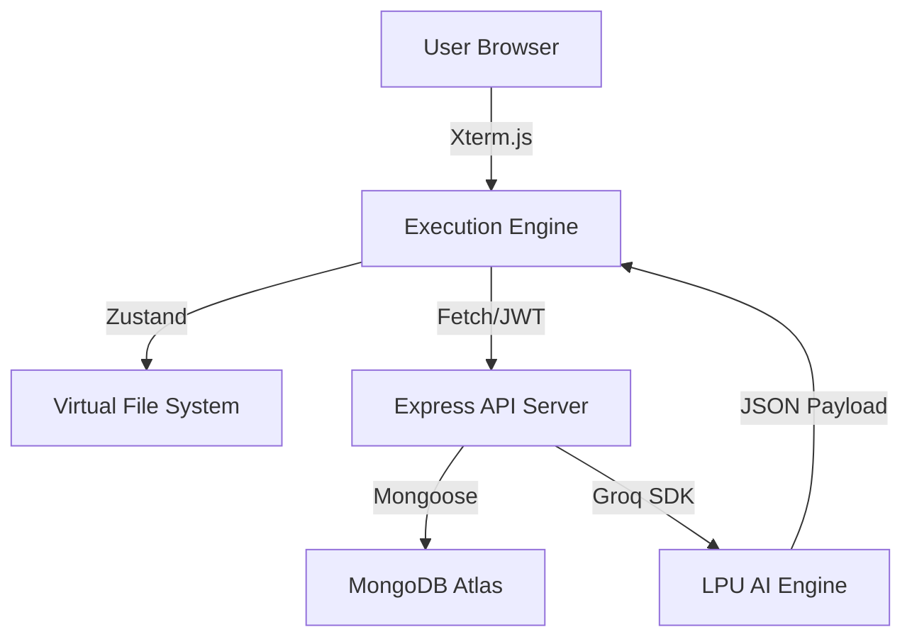

# <p align="center">🚀 HyperOS: The AI-Powered Web Terminal</p>

<p align="center">
  
  
  
  
</p>

---

## 🌟 Overview

**HyperOS** is a next-generation, high-performance terminal emulator running entirely in your browser. It doesn't just mimic a terminal—it provides a full **Autonomous AI Workspace**. Bridging the gap between traditional UNIX workflows and modern LLM capabilities, HyperOS allows you to write, compile, and execute code with an integrated AI co-pilot that understands your terminal's every move.

### 🖼️ Visual Experience

| **Authentication Portal** | **Command Center (Main Terminal)** |
|:---:|:---:|
|  |  |
| *Secure Cloud Access with JWT Auth* | *High-Performance UNIX-like Shell* |

---

## 🧠 Autonomous AI Co-Pilot

HyperOS features a deeply integrated AI assistant powered by the **Groq LPU Inference Engine**. 

- **Context-Aware:** The AI knows your Current Working Directory (CWD), your file contents, and your command history.
- **Autonomous Execution:** The AI can generate code, write it to your Virtual File System, and even run the compilation commands automatically.
- **Natural Language to Shell:** Simply type `ai <your request>` to interact.

| **AI Interaction Example** |
|:---:|
|  |
| *AI writing, compiling, and running code autonomously* |

---

## 🛠️ Advanced Tech Stack

<p align="center">
  
</p>

### 💻 Core Infrastructure
*   **Terminal Rendering:** [Xterm.js](https://xtermjs.org/) with WebGL support for ultra-smooth 60FPS rendering.
*   **State Orchestration:** [Zustand](https://zustand-demo.pmnd.rs/) for unified, high-speed state management of the VFS and terminal loop.
*   **Intelligence:** [Groq SDK](https://groq.com/) leveraging `llama-3.3-70b-versatile`.
*   **Backend:** Node.js 22+ with Express.js and Mongoose.
*   **Security:** JWT (JSON Web Tokens) with 256-bit encryption and Bcrypt salt-hashing.

---

## 📊 System Policies & User Limits

To ensure high performance and fair resource allocation, the following limits are enforced per user:

| Feature | Limit | Description |
| :--- | :--- | :--- |
| **VFS Storage** | **16 MB** | Maximum persistent storage for files and directories (MongoDB Doc Limit). |
| **JSON Payload** | **10 MB** | Maximum size for data synchronization requests. |
| **AI Context** | **5 Commands** | The AI assistant reads the last 5 commands for immediate context. |
| **Session Expiry** | **24 Hours** | JWT tokens expire after 24 hours of inactivity. |
| **History Buffer** | **500 Lines** | Maximum command history stored in the local session. |
| **VFS Node Limit** | **1,000 Nodes** | Maximum number of files and folders per user workspace. |

---

## 📐 Architecture Overview

HyperOS utilizes a **3-Tier Cloud Architecture** designed for low-latency interactions.



---

## ⚡ Features & Commands

### 📁 File Management
- **Navigation:** `cd`, `pwd`, `ls -l`
- **Manipulation:** `mkdir`, `touch`, `rm -rf`, `cp`, `mv`
- **Advanced Processing:** `grep`, `cat`, `head`, `tail`, `wc`

### 🏗️ Development Tools
- **Built-in Editor:** `nano` (Full screen alternate buffer editor).
- **Mock Compiler:** `gcc` (Transpiles C printf logic to executable JS).
- **Script Runner:** `node` (Execute any `.js` file stored in your VFS).
- **Network:** `curl` (Fetch real-world API data into your terminal).
- **Simulation:** `os_sim` (Simulate FCFS, Banker's, and Page Replacement algorithms).

---

## 🚀 Getting Started

### Prerequisites
- Node.js v18+ 
- MongoDB Instance (Local or Atlas)
- Groq Cloud API Key

### Installation

1. **Clone & Install Dependencies**
   ```bash
   git clone https://github.com/Purushotham-Prajapati-24/ImplementationOfCommandPrompt.git
   cd ImplementationOfCommandPrompt
   npm install
   cd server && npm install
   ```

2. **Environment Configuration**
   Create `server/.env`:
   ```env
   PORT=5000
   MONGODB_URI=your_mongodb_connection_string
   JWT_SECRET=your_super_secret_key
   GROQ_API_KEY=your_groq_api_key
   ```

3. **Launch**
   ```bash
   # In root
   npm run dev
   
   # In /server
   npx ts-node src/index.ts
   ```

---

## 🔮 Future Roadmap
- [ ] **WASM Core:** Full binary support via Emscripten.
- [ ] **Multiplayer:** Real-time collaborative terminal sessions.
- [ ] **Shell Scripting:** Implementation of loops and conditionals.

---

<p align="center">
  Developed by <b>Purushotham Prajapati</b><br/>
  <i>Redefining the CLI experience for 2026 and beyond.</i>
</p>
